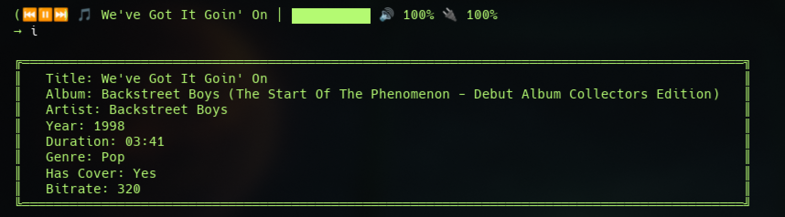
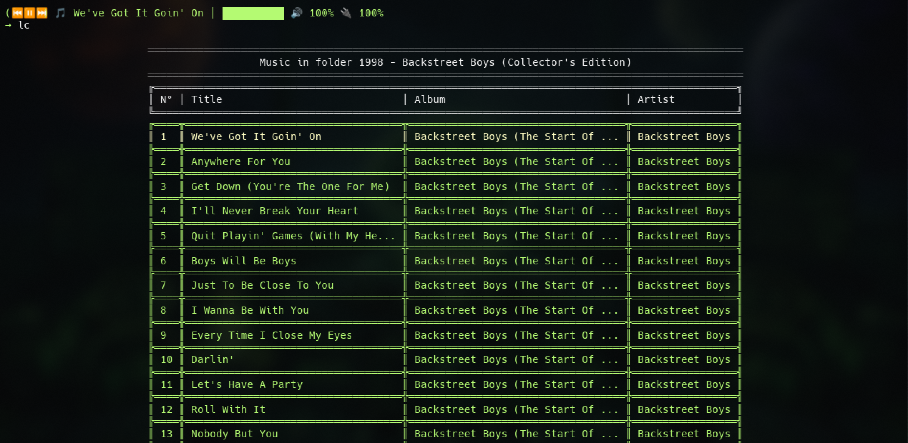

<p align="center">
  
</p>

<h1 align="center">muplayer</h1>
<p align="center">A lightweight Java library for native music playback</p>

<p align="center">
  
  
  
</p>

## Features

- Native playback for multiple audio formats
- Metadata extraction with jaudiotagger
- Lightweight and minimal dependencies
- Event-driven architecture with MessageBus
- Console player included

## Supported Formats

> ✅ Full support &nbsp;&nbsp;
> ⚠️ Experimental support &nbsp;&nbsp;
> ❌ No support yet

| Format | Status |
|:------:|:------:|
| MP3    | ✅     |
| OGG    | ✅     |
| FLAC   | ✅     |
| WAV    | ✅     |
| AIFF   | ✅     |
| AAC    | ⚠️     |
| M4A    | ⚠️     |
| OPUS   | ❌     |
| WMA    | ❌     |
| ALAC   | ❌     |

## Requirements

- JDK 25 or higher

## Installation

### Maven
```xml
<dependency>
    <groupId>cl.estencia.labs</groupId>
    <artifactId>muplayer</artifactId>
    <version>4.0.0</version>
</dependency>
```

### Gradle
```groovy
dependencies {
    implementation 'cl.estencia.labs:muplayer:4.0.0'
}
```

## Usage

### Basic playback

```java
import cl.estencia.labs.muplayer.audio.player.MusicPlayer;

MusicPlayer player = new MuPlayer("/path/to/music");
player.start();
```

### Event-driven mode

Control the player through messages without direct interaction with the player object:

```java
import cl.estencia.labs.muplayer.core.bus.message.Events;

// Start playback
player.sendEvent(Events.start());

// Playback controls
        player.

sendEvent(Events.play());
        player.

sendEvent(Events.pause());
        player.

sendEvent(Events.resume());
        player.

sendEvent(Events.stop());

// Navigation
        player.

sendEvent(Events.playNext());
        player.

sendEvent(Events.playPrev());
        player.

sendEvent(Events.playIndex(5));

// Volume control
        player.

sendEvent(Events.setVolume(75.0f));
        player.

sendEvent(Events.mute());
        player.

sendEvent(Events.unmute());

// Shutdown player
        player.

sendEvent(Events.shutdown());
```

### Listening to player events

```java


player.addResponseListener(playerInfo ->{
Track currentTrack = playerInfo.getCurrentTrack();

infoLine("Now playing: "+currentTrack.getTitle());
        });
```

### Console player
```bash
java -jar muplayer.jar /path/to/music
```

#### Demo
<p align="center">
  
</p>
<p align="center">
  
</p>

## Building from source
```bash
mvn clean install
```

## Contributing

1. Fork the repository
2. Create a branch (`git checkout -b feature/new-feature`)
3. Commit your changes (`git commit -am 'Add new feature'`)
4. Push (`git push origin feature/new-feature`)
5. Open a Merge/Pull Request

## License

[Apache License 2.0](https://www.apache.org/licenses/LICENSE-2.0)